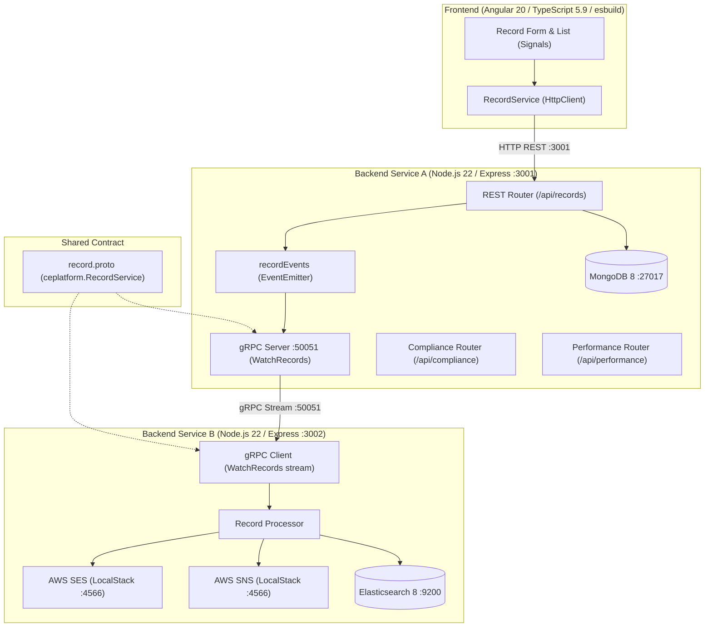

# Demo_Stack — Reference Platform Stack & Metrics Testbed

A reference microservices and frontend platform testbed configured for static analysis, security scanning, compliance verification, and performance benchmarking against the **Testable Engineering Strategy Matrix (v0.2)**.

---

## 🛠 Technology Stack Configuration

| Layer / Service | Technology | Version | Bundler / Tooling | Role / Port |
| :--- | :--- | :--- | :--- | :--- |
| **Frontend** | **Angular** | `20.3.0` | **esbuild** (`@angular/build`) + npm | Angular 20 SPA with Signals, Biome, ESLint |
| **Backend Service A** | **Node.js / Express** | `22.0+` | CommonJS + npm | REST API (`:3001`), gRPC Server (`:50051`), Mongoose 8 |
| **Backend Service B** | **Node.js / Express** | `22.0+` | CommonJS + npm | REST (`:3002`), gRPC Client, Elasticsearch, AWS SDK |
| **Data Layer 1** | **MongoDB** | `8.0` | `mongo:8` (Docker) | Primary persistent document store (`:27017`) |
| **Data Layer 2** | **Elasticsearch** | `8.15.3` | Docker (`docker.elastic.co`) | Search & analytics engine (`:9200`) |
| **Messaging / Eventing**| **gRPC** | `1.11.3` | `@grpc/grpc-js` + `@grpc/proto-loader` | Server-streaming RPC contract (`shared/proto/record.proto`) |
| **Cloud Services** | **LocalStack (AWS)** | `3.0` | `localstack/localstack:3` (Docker)| Emulates AWS SNS, SES, SQS (`:4566`) |

---

## 📐 Architecture & Data Flow



---

## 📊 Strategy & Metrics Coverage (Testable Strategy v0.2)

This repository is instrumented with full test fixtures, code patterns, and live endpoints covering both **Static Code Analysis (Repository Plane)** and **Dynamic URL Testing (API Plane)**:

### 1. Structural & Complexity Analysis
* **Cyclomatic & Cognitive Complexity:** Layered branches, decision-points, and $O(n^3)$ triply nested loops for AST / Big-O complexity analyzers (`src/utils/recordAnalytics.js`, `record-analytics.ts`).
* **Code Duplication:** Cross-service identical CSV/NDJSON transformers for `jscpd` and SonarJS clone detection (`src/utils/exportFormat.js`, `export-format.ts`, `export-format-legacy.ts`).
* **Data Flow Testing:** Variable definition-use mapping (All-Defs, C-Use computations, P-Use predicate branch decisions).

### 2. Static Application Security (SAST) & Supply Chain (SCA)
* **SAST:** Input sanitization (`sanitizeInputString`), safe path traversal resolution (`resolveSafeFilePath`), parameterized queries (`src/utils/internalDiagnostics.js`).
* **SCA:** Multi-tier dependency trees in lockfiles (`package-lock.json`), license compliance metadata (`license-checker`), vulnerability databases (`cve-lite-cli`, `npm audit`).

### 3. Compliance & Governance
* **GDPR:** Privacy Notice endpoint (`/privacy`), DSAR export (`GET /api/compliance/gdpr/export/:userId`), Right to Erasure (`DELETE /api/compliance/gdpr/erase/:userId`).
* **FERPA & COPPA (EdTech):** Under-13 parental consent verification (`POST /api/compliance/coppa/consent`), student record purge (`DELETE /api/compliance/ferpa/student/:studentId`), PII masking.
* **PCI-DSS (Retail):** Primary Account Number (PAN) masking (`POST /api/compliance/pci/mask-card`).
* **SOC 2 & Secrets:** Audit logging endpoint (`GET /api/compliance/soc2/audit-logs`), `.gitleaks.toml` secret scanning rules, and `.github/pull_request_template.md` peer-review checklist.

### 4. Performance & Reliability Testing
* **Static Anti-Patterns:** ORM N+1 query loop modeling (`detectQueryBottlenecks`), memory allocation inside loops (`evaluateMemoryUsage`), bundle size tracking.
* **Dynamic Telemetry:** Soak memory/CPU telemetry (`GET /api/performance/soak`), spike recovery simulation (`GET /api/performance/spike`), cache hit rate telemetry (`GET /api/performance/cache-stats`).
* **K6 Load Testing:** Dynamic load test script (`perf/k6-load-test.js`) evaluating throughput (RPS), p95/p99 tail latency, 4xx/5xx error rates, and virtual users concurrency (up to 100 VU).

---

## 🚀 Quick Start & Verification

### 1. Infrastructure (Docker Compose)
```bash
docker-compose up -d
```

### 2. Backend Service A (REST + gRPC Server)
```bash
cd backend-service-a
npm install
npm run check       # Entrypoint syntax check
npm test            # 23 passing Mocha unit & integration tests
npm run coverage    # Cobertura XML & Istanbul coverage report
npm start           # Starts HTTP :3001 and gRPC :50051
```

### 3. Backend Service B (gRPC Consumer + Elasticsearch + AWS)
```bash
cd ../backend-service-b
npm install
npm run check       # Entrypoint syntax check
npm test            # 13 passing Mocha integration tests
npm run coverage    # Cobertura XML & Istanbul coverage report
npm start           # Starts HTTP :3002 and connects to gRPC
```

### 4. Frontend (Angular 20 SPA)
```bash
cd ../frontend
npm install
npm run lint:biome  # Biome linter & formatter check
npx ng build        # Builds production bundle using esbuild Application Builder
npm start           # Serves frontend on http://localhost:4200
```

### 5. Dynamic K6 Performance Testing
```bash
k6 run perf/k6-load-test.js
```